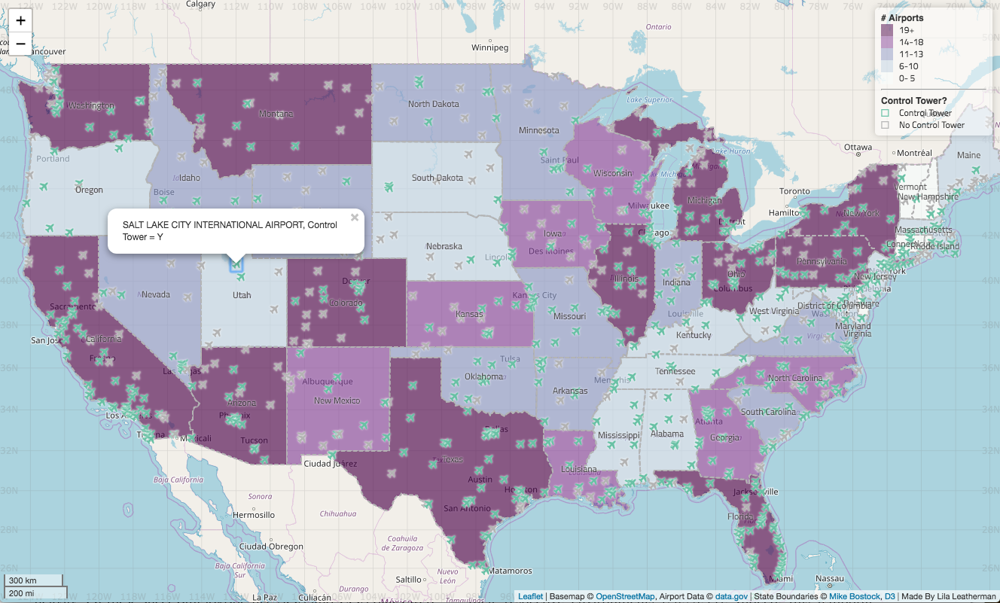

# Interactive map of airports in the United States

### Created for Oregon State University Geovisualization (GEOG 572), Spring 2018

#### Overview

Displays a map of airports in the contiguous United States. The map assigns each state a color based on the number of airports in the state. Further, the map allow users to assess whether or not an airport has a control tower, via colored icons pop-up windows that appear when individual airport icons are clicked. The popup icons also display the name of the airport.

#### Major Functions

- Pop-up windows to display airport name and control tower status
- Apply colors and icons based on geojson data
- Create a legend to identify colors and icons
- Create dynamic labels for state names
- Add scale bar
- Add graticules
- Apply custom projection

#### Libraries Used

- Map interface: [Leaflet][http://leafletjs.com]
- Icons: [Font Awesome][https://fontawesome.com/]
- Fonts: [Titillium][https://fonts.google.com/specimen/Titillium+Web]
- Label gun: [rbush][https://unpkg.com/rbush@2.0.1/] & [labelgun][https://unpkg.com/labelgun@6.0.0/lib/labelgun.min.js]
- Custom map projections: [Proj4js][http://proj4js.org/] & [Proj4Leaflet][https://kartena.github.io/Proj4Leaflet/]
- Graticules: [leaflet.latlng-graticule][https://github.com/cloudybay/leaflet.latlng-graticule]
- [Leaflet.ajax][https://github.com/calvinmetcalf/leaflet-ajax], [Chroma][https://gka.github.io/chroma.js/], and [jQuery][https://jquery.com/]

#### Data Sources

- Airport data: [Data.gov][Data.gov]
- State boundaries: [Mike Bostock][https://bost.ocks.org/mike/], [D3][https://d3js.org/]
- Basemap: [OpenStreetMap.Mapnik][http://leaflet-extras.github.io/leaflet-providers/preview/#filter=OpenStreetMap.Mapnik]

